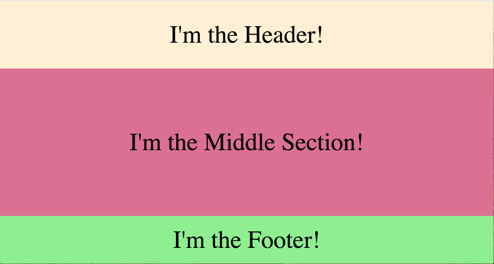
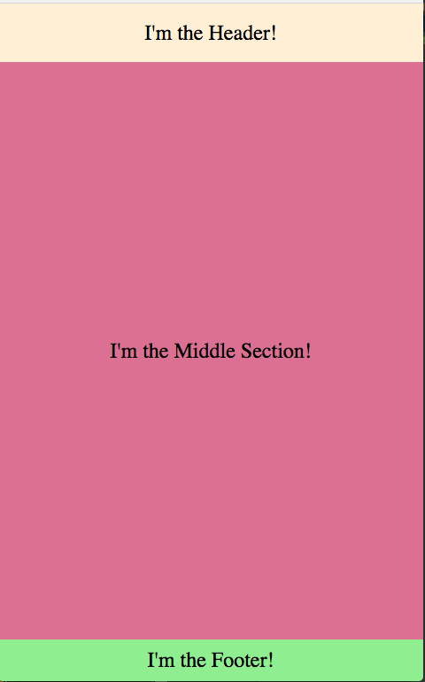

# Header Footer Flex Middle Webpage

An example of a common layout for a web page or web app that leverages flex positioning.

## Why?
This is useful for sites that have a small header and footer and need the middle section to stretch to fill the remaining space. With older css methods it has been historically pretty difficult to line everything up perfectly and have the context extend the full height or the page, no more and no less. However, with some flex position this becomes a breeze. 

## Try the live demo!
Try it out here: https://jimtheman.github.io/Header-Footer-Flex-Middle-Webpage/
 
Desktop screenshot:

Phone screenshot:

## How I did it

The power of flex is all in the css. Basically, "parent" elements (things that contain flexible elements) should have the the css property `display: flex;`.
                                                                                                                                                 
If you want things to stack vetically as they do in the example here, you can also add `flex-direction: column;`.                        
                                                         
Then for the child components add the css property `flex: 1;`.

There's a lot more to flex css, but that's all that's needed to recreate this project!

## Contributing
Feel free to open issues or pull requests if you have questions or comments! :)
                                                                                                                       
Stay flexin' friends!                                                                                                                       
